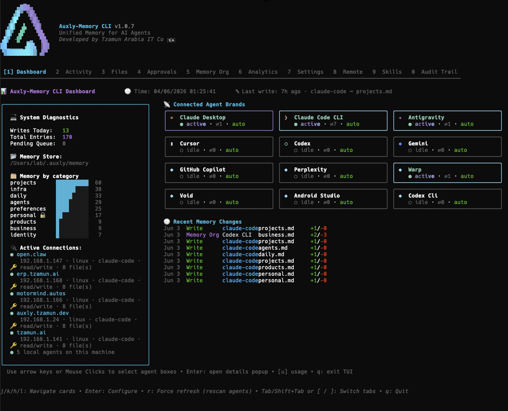
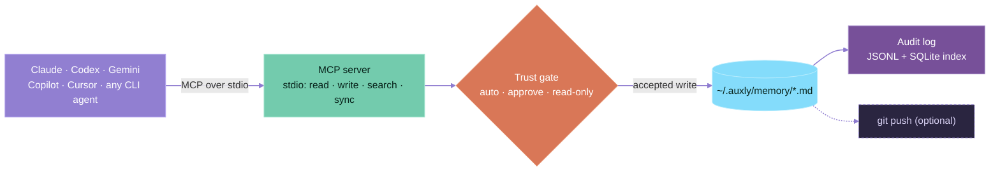
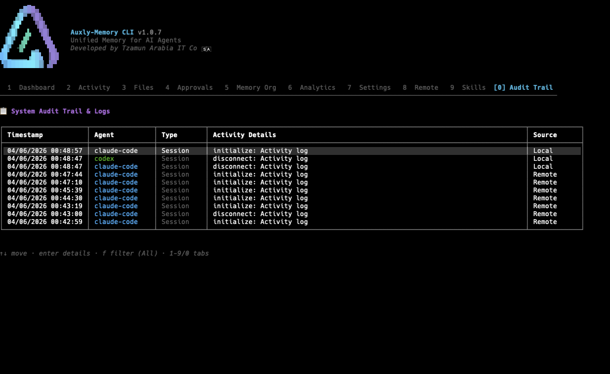
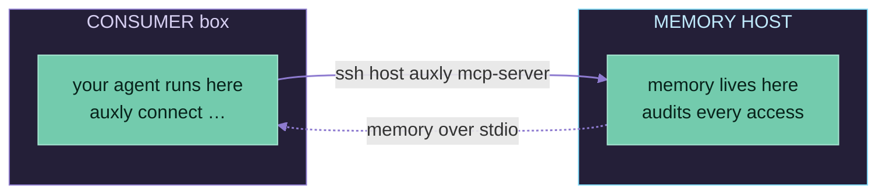
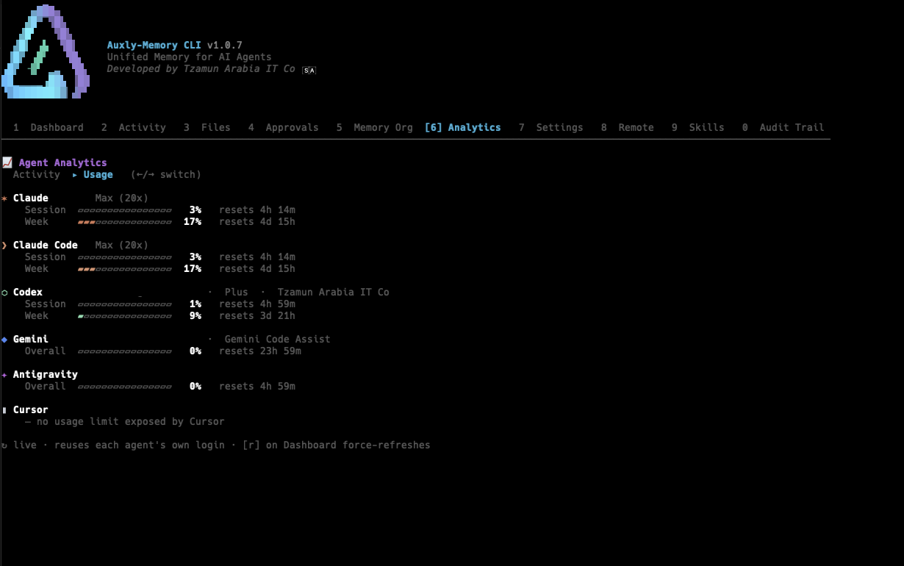
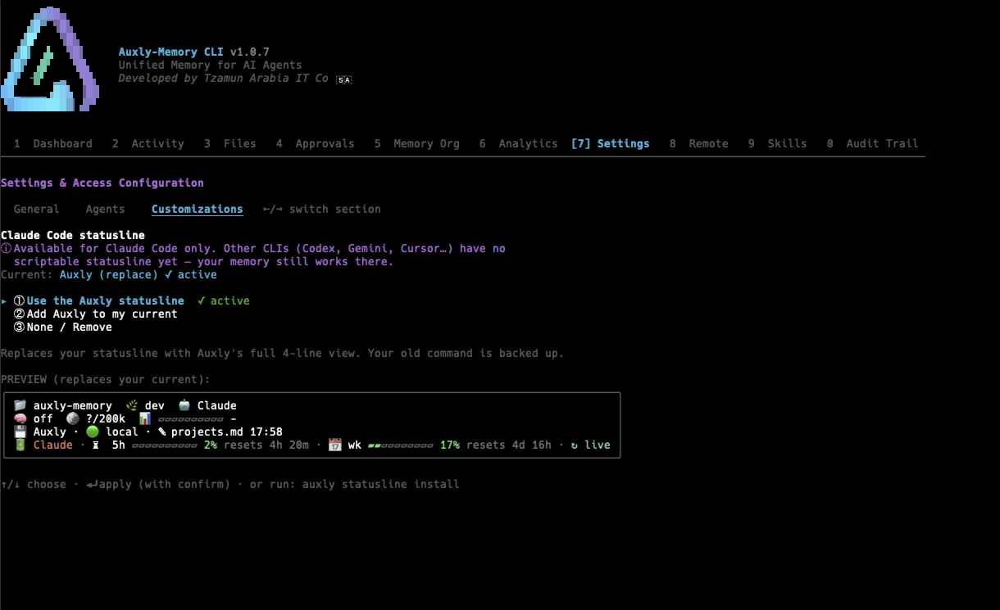

<div align="center">


### One memory. Every AI agent. On your machine.

**Auxly is a local-first, file-based memory layer that every AI agent you use — Claude, Codex, Gemini, Copilot, Cursor, Antigravity, and any CLI agent — reads from and writes to as a single shared source of truth.**

No cloud. No database. No vendor lock-in. Just Markdown files you own, with an audit trail you can read and a review queue you control.

[](https://github.com/Tzamun-Arabia-IT-Co/auxly-memory-cli/releases)
[](https://github.com/Tzamun-Arabia-IT-Co/auxly-memory-cli/releases)
[](https://github.com/Tzamun-Arabia-IT-Co/auxly-memory-cli/stargazers)
[](LICENSE)
[](go.mod)


<br />



<sub>One local dashboard for every agent you use — connected brands, memory by category, recent writes, and live remote connections.</sub>

</div>

---

## 🆕 What's New in Version 1.0.19

**One-click Windows boxes — add a Windows machine from the TUI and everything configures itself.** The host-push **Connect new** flow installs auxly, authorizes the key, and wires the box's agent (MCP + skills + statusline) end-to-end over SSH, with **no commands to run on the box**. The Windows-specific stalls and false "Done" headers are fixed, **`[u]` Update works on a live Windows box**, and relay-connected boxes show their host name in the statusline (no longer "Local").

### 🪟 Connecting a Windows box — two ways

**Option A — from the host's TUI (one click):** open the **Remote** tab → **`c` Connect new** → point it at `user@windows-box`. Auxly handles install + key-auth + agent wiring automatically, then just restart the agent on the box.

**Option B — on the box (also fully supported):**

1. **On the host** (your Mac/Linux machine) — publish its memory and open the relay tunnel:
   ```bash
   auxly host setup --rendezvous <user@windows-box>
   ```
2. **On the Windows box** — install auxly and connect it (in PowerShell):
   ```powershell
   irm https://auxly.io/cli.ps1 | iex
   auxly connect auto          # or run the /auxly-remote-connect skill in your agent
   ```

> **Under the hood (1.0.18):** the host-push install + readiness check run concurrently on an isolated SSH connection, so a lingering Windows installer session can't stall the connect; agent wiring and `[r] reconnect` run on a fresh post-install connection (so `auxly` resolves on the box's updated PATH); a failed provision now surfaces honestly instead of a green "Done"; and the Windows installer swaps the binary safely even while a live session is using it, so **`[u]` Update works on a connected Windows box**.

### Other Windows capabilities (all working)
- **Connect *to* a Windows box** (`auxly connect`) — auto-detects OS, provisions via **PowerShell** instead of POSIX `sh` (the old `'sh' is not recognized` failure is gone), auto-installs a clean host.
- **🧠 Windows as a memory host** — serves its vault via `auxly mcp-server` over SSH; keep-alive via Windows Task Scheduler.
- **🗂️ Cross-platform agent config** — Claude, Cursor, Copilot, Gemini configs resolve under `%APPDATA%` / `%LOCALAPPDATA%` on Windows (and `~/.config` on Linux).

See the [CHANGELOG](CHANGELOG.md) for the full list.

---

## Contents

- [Why Auxly](#why-auxly)
- [How it works](#how-it-works)
- [Install](#install)
- [Uninstall](#uninstall)
- [Quick start](#quick-start)
- [The memory vault](#the-memory-vault)
- [Trust & access control](#trust--access-control)
- [Skills (slash commands)](#skills-slash-commands)
- [Supported agents](#supported-agents)
- [Setup guide](#setup-guide)
- [The dashboard](#the-dashboard)
- [Remote memory over SSH](#remote-memory-over-ssh)
- [Live Usage](#live-usage)
- [Statusline (Claude Code · Cursor · Antigravity)](#statusline-claude-code--cursor--antigravity)
- [Git sync](#git-sync)
- [Connect any MCP agent](#connect-any-mcp-capable-agent-manual-setup)
- [Command reference](#command-reference)
- [Configuration](#configuration)
- [Security & privacy](#security--privacy)
- [Contributing](#contributing)
- [License](#license)

---

## Why Auxly

### The problem

Every AI agent keeps its own memory in its own walled garden. Tell Claude your stack, then open Codex — it knows nothing. Switch to Gemini — start over. Your context is fragmented across a dozen tools, none of them talk to each other, and none let you see or correct what they "remember" about you.

### What Auxly does

Auxly gives all of your agents **one** memory — a folder of Markdown files on your own machine — and wires every agent to it through the [Model Context Protocol (MCP)](https://modelcontextprotocol.io). Teach one agent something once; every other agent knows it instantly. Because the memory is plain Markdown under your control, you can read it, edit it, diff it, and version it in Git like any other file.

### The benefits

| | Benefit |
|---|---|
| 🧠 **Shared context** | Say it once to any agent — all your other agents inherit it. No more re-explaining your stack, preferences, or projects per tool. |
| 📂 **You own the data** | Memory is Markdown in `~/.auxly/memory/`. Open it in any editor, grep it, commit it. Nothing is locked inside a vendor's cloud. |
| 🔒 **Local-first & private** | No server, no telemetry, no embeddings, no Docker. Memory never leaves your machine unless *you* push it to a Git remote. |
| 🛂 **You stay in control** | Per-agent trust levels decide whether a write lands instantly, queues for your approval, or is denied. |
| 🧾 **Fully auditable** | Every read and write is logged append-only with who, what, when, and why — surfaced in a live dashboard. |
| 🌐 **Works across machines** | Share one memory host with NAT'd servers and laptops over plain SSH — no daemon, no open port, no token. |
| 🖱️ **TUI + CLI, same power** | An interactive dashboard you drive with **mouse or keyboard**, plus a fully scriptable **CLI** — every action works both ways. |
| 🆓 **Free & open** | MIT-licensed Go binary. Single static file, zero runtime dependencies. |

---

## How it works

Auxly is a single static Go binary that plays three roles at once:



1. **MCP server** — `auxly mcp-server` exposes tools (read, write, search, sync, …) to any MCP-capable agent over stdio. Agents call them like any other tool.
2. **Trust gate** — every write is checked against the writing provider's trust level: write directly, queue for human approval, or reject.
3. **Memory vault** — accepted writes land as Markdown in `~/.auxly/memory/`, optionally auto-committed to Git.
4. **Audit** — every access is recorded to an append-only JSON Lines log and indexed in SQLite for instant querying in the dashboard.

The only "database" anywhere is a local SQLite file used purely to index the audit log. There are **no embeddings, no background daemon, and no network calls** in normal operation.

---

## Install

### macOS & Linux

```bash
curl -fsSL https://auxly.io/cli | sh
```

Install **and** wire up your local agents in one go:

```bash
curl -fsSL https://auxly.io/cli | sh -s -- --setup
```

### Windows (PowerShell)

```powershell
irm https://auxly.io/cli.ps1 | iex
```

### Homebrew

```bash
brew install Tzamun-Arabia-IT-Co/homebrew-tap/auxly
```

### Go

```bash
go install github.com/Tzamun-Arabia-IT-Co/auxly-memory-cli@latest
```

### From source

```bash
git clone https://github.com/Tzamun-Arabia-IT-Co/auxly-memory-cli.git
cd auxly-memory-cli
make build         # produces ./auxly
# Apple Silicon dev builds: codesign --force --sign - ./auxly
```

Prebuilt binaries, `.deb`, and `.rpm` packages are on the [Releases page](https://github.com/Tzamun-Arabia-IT-Co/auxly-memory-cli/releases). Binaries are CGO-free single files — nothing to extract, no shared libraries to install.

---

## Uninstall

Auxly is a single static binary plus a `~/.auxly` data directory — no system services to scrub unless you ran `auxly host setup` (which installs a per-user keep-alive). The steps below remove the binary, the keep-alive (if any), and your local data.

> ⚠️ **`~/.auxly` holds your memory vault** (`~/.auxly/memory`) on your **main** machine. Only delete it on a *consumer* box (one that just uses another machine's memory over SSH), or **after exporting** your vault. On a consumer box `~/.auxly` only holds connection config — safe to delete. Export first with `auxly export` if unsure.

If the machine is wired to an agent, un-wire it first (removes the MCP launcher + `/auxly-*` skills) while the binary still exists:

```bash
auxly connect disconnect <name> --purge      # <name> = the saved profile, see `auxly connect list`
```

### macOS & Linux

```bash
# Remove the keep-alive service if you were a memory HOST (no-op otherwise)
auxly host down 2>/dev/null || true
# macOS launchd leftover:
rm -f ~/Library/LaunchAgents/io.auxly.host.plist
# Linux systemd-user leftover:
systemctl --user disable --now auxly-host.service 2>/dev/null || true
rm -f ~/.config/systemd/user/auxly-host.service

# Remove the binary (whichever path it installed to)
sudo rm -f /usr/local/bin/auxly
rm -f ~/.local/bin/auxly

# Remove local data/config  (see vault warning above)
rm -rf ~/.auxly
```

### Windows (PowerShell)

```powershell
# Un-wire agent + skills, then remove host keep-alive task (no-op on a consumer box)
auxly connect disconnect <name> --purge 2>$null
schtasks /End /TN "Auxly-Host" 2>$null;  schtasks /Delete /TN "Auxly-Host" /F 2>$null

# Delete the binary + per-user install dir
$dir = Join-Path $env:LOCALAPPDATA 'Programs\auxly'
Remove-Item -Recurse -Force $dir -ErrorAction SilentlyContinue

# Strip it from your per-user PATH
$p = [Environment]::GetEnvironmentVariable('Path','User')
[Environment]::SetEnvironmentVariable('Path', (($p -split ';' | Where-Object { $_ -and $_ -ne $dir }) -join ';'), 'User')

# Delete local data/config  (see vault warning above)
Remove-Item -Recurse -Force "$env:USERPROFILE\.auxly" -ErrorAction SilentlyContinue
```

### Homebrew

```bash
brew uninstall auxly
rm -rf ~/.auxly      # data is not removed by brew (see vault warning above)
```

After uninstalling, **restart your terminal and any AI agent** so the dropped MCP launcher and PATH change take effect.

---

## Quick start

Auxly is built around **one command** — just run `auxly`:

```bash
auxly
```

- **First run** walks you through a short setup wizard and creates your memory vault.
- **Every run after that** opens the full-screen **dashboard**.

That's the whole entry point — there's no separate "init" or "ui" step to remember (those exist as explicit aliases, but you never need them).

Next, connect your AI agents to the shared memory:

```bash
auxly setup
```

This detects every AI agent installed on your machine (Claude, Codex, Gemini, Cursor, Antigravity, …) and wires each one to Auxly via MCP — plus installs the `/auxly-*` slash commands. No manual config editing.

Now, inside any connected agent's chat, start teaching it:

```
/auxly-init                  # scans the conversation and seeds your memory
/auxly-sync  I prefer pnpm and deploy on Vercel
/auxly-memory                # shows the profile every agent now shares
```

From here on, anything any agent learns about you can be saved with `/auxly-sync`, and every other agent picks it up automatically.

---

## The memory vault

Your memory lives in `~/.auxly/memory/` as human-readable Markdown, organized by topic. Smart sync files each new fact under the right category — the agent picks the best-fit category from the taxonomy, with a keyword router as fallback when it's unsure:

```
~/.auxly/memory/
├── identity.md        # who you are, role, expertise
├── personal.md        # private life facts (family, health, finances) — never shared to a remote unless you grant it
├── preferences.md     # how you like your agents to work
├── infra.md           # machines, networks, environments
├── products.md        # products & services you build
├── projects.md        # active work, goals, constraints
├── business.md        # business / organizational context
├── daily.md           # recent, time-bound notes
├── agents.md          # registry of connected agents
├── CLAUDE.md · CODEX.md · GEMINI.md · …   # per-agent instruction files
├── trust.yaml         # per-provider access control
├── git.yaml           # Git sync configuration
├── .audit.log         # append-only audit trail (JSON Lines)
├── audit.db           # SQLite index of the audit log
└── .pending/          # writes awaiting your approval
```

Edit any of these by hand at any time — Auxly treats the files as the source of truth.

---

## Trust & access control

You decide what each provider is allowed to do. Trust levels live in `trust.yaml`:

| Level | Behavior |
|-------|----------|
| `auto` | Writes land in memory immediately |
| `require_approval` | Writes queue in `.pending/` for you to review and approve/reject |
| `read_only` | Provider can read but never write |

```bash
auxly trust list                       # show current levels
auxly trust set claude auto            # trust Claude to write directly
auxly trust set codex require_approval # review Codex's writes first
auxly trust set copilot read_only      # let Copilot read but not write
```

Pending writes show up as reviewable diffs in the dashboard's **Approvals** tab — approve or reject with a keystroke.

---

## Skills (slash commands)

`auxly setup` installs **10 slash commands** into every agent it configures. They work natively inside the agent's chat:

| Skill | What it does |
|-------|--------------|
| `/auxly-init` | Onboards you — runs the training, scans the current conversation/context, and seeds your memory with what's already known. |
| `/auxly-sync` `<fact>` | Saves a new fact, preference, or detail with a smart delta-merge — the agent files it under the best-fit category (with a keyword router as fallback). |
| `/auxly-memory` | Prints the consolidated profile (identity + preferences + infrastructure) every agent currently shares. |
| `/auxly-learn` `[folder] [topic]` | Reads the memory vault — optionally a single folder, optionally focused on a topic — and grounds the agent in it for the session. No args = learn everything. |
| `/auxly-max` | Exhaustive self-harvest — scans the whole session and writes every fact up into the vault, one category at a time (private facts go to `personal.md`). Push-only. |
| `/auxly-forget` `[query]` | Searches memory and cleanly prunes obsolete or outdated lines. |
| `/auxly-pending` `[list\|approve\|reject]` | Manages the approval queue from inside the chat panel. |
| `/auxly-status` | Shows whether the agent is connected and the MCP link is live, plus diagnostics. |
| `/auxly-bootstrap` | Generates a copyable onboarding block to paste into a tool that doesn't have Auxly installed (e.g. ChatGPT). |
| `/auxly-remote-connect` | Detects and connects this machine to a remote Auxly memory host (or reports the active link). |

Under the hood these map to MCP tools (`auxly_skill_sync`, `auxly_memory_read`, `auxly_memory_write`, `auxly_memory_search`, `auxly_pending_list`, …) that any MCP client can call directly.

---

## Supported agents

`auxly setup` auto-detects what you have installed and writes the MCP configuration for each — no manual JSON editing:

| Agent | Integration |
|-------|-------------|
| **Claude Desktop** | MCP server entry (+ importable skills — see [Setup guide](#setup-guide)) |
| **Claude Code** (CLI) | `claude mcp add` + skills |
| **Codex** (IDE & CLI) | MCP + `codex mcp add` |
| **Cursor** (IDE & Agent CLI) | MCP + auto-approved tool allowlist |
| **Gemini CLI** | MCP server entry + skills |
| **Antigravity** (CLI / Agent / IDE) | MCP server entries |
| **GitHub Copilot** | shared memory via MCP/skills |
| **Warp** (terminal) | MCP — `~/.warp/.mcp.json` |
| **Void** (editor) | MCP — `~/.void-editor/mcp.json` |
| **Windsurf**, **Kimi Code**, **Trae** | MCP + workspace rules |
| **Android Studio** | MCP via the Gemini Agent or JetBrains AI Assistant — [manual setup](#connect-any-mcp-capable-agent-manual-setup) |
| **Any MCP client / CLI agent** | paste an MCP entry ([manual setup](#connect-any-mcp-capable-agent-manual-setup)) or call `auxly read/write/search` |

For each agent, Auxly also drops a workspace rules file (`.clauderules`, `.cursorrules`, `.geminirules`, …) so the agent knows to keep your memory in sync.

---

## Setup guide

### Automatic setup (recommended)

```bash
auxly setup
```

This detects every supported agent on your machine, writes each one's MCP configuration, installs the `/auxly-*` slash commands, and drops a workspace rules file so the agent keeps your memory in sync. Re-run it any time you install a new agent — it's idempotent and only updates what's needed.

**Verify a connection** from inside the agent's chat:

```
/auxly-status
```

…or just open the dashboard (`auxly`): every connected agent appears on the grid, and its reads/writes show live in the **Activity** tab.

### Claude Desktop skills (one manual step)

Claude Desktop is the **only** agent that needs a manual touch. `auxly setup` wires its **MCP connection** automatically, but Claude Desktop doesn't load skills from disk — so the `/auxly-*` slash commands have to be **imported once**:

1. **Run `auxly setup`.** It exports the skills to `~/Downloads/auxly-skills-v<version>/` as ready-to-import `.zip` files — one per skill.
2. Open **Claude Desktop → Settings → Capabilities → Skills** (older builds: **Settings → Skills**).
3. **Add each `.zip`** from that folder (use *Upload skill* / drag-and-drop). You only do this once.
4. **Restart Claude Desktop** if the new skills don't show up right away.

The export folder is version-stamped (`…-v<version>/`), so when a release updates the skills you'll know to re-import the new set. *(Every other agent — Claude Code, Codex, Gemini, Cursor, … — picks up skills automatically; this import step is Claude-Desktop-only.)*

### Connect any other MCP agent

`auxly setup` covers the agents listed above. **Any** other tool that speaks MCP — Android Studio, Perplexity, a homegrown client — can share the exact same memory with a one-time copy-paste config. The full walkthrough with the ready-to-paste JSON is at the end of this README:

➜ **[Connect any MCP-capable agent (manual setup)](#connect-any-mcp-capable-agent-manual-setup)**

---

## The dashboard

`auxly` opens a **fully interactive terminal UI**. Drive it with the **mouse** — click tabs, agent cards, files, and buttons, and scroll lists — *or* the keyboard, whichever you prefer. And everything Auxly does is available **two ways**: as a scriptable **CLI command** (great for automation and muscle memory) *and* as a point-and-click action in the TUI. Same capabilities, your choice of interface.

The TUI has ten tabs:

| # | Tab | What you see |
|---|-----|--------------|
| 1 | **Dashboard** | Today's writes, pending approvals, and a live grid of your connected agents |
| 2 | **Activity** | Live audit feed, color-coded by provider, local vs. SSH-remote |
| 3 | **Files** | Browse, view, edit, and download your memory files — press **`e`** to export the whole vault to `~/Downloads` (also `auxly export`) |
| 4 | **Approvals** | Review pending diffs — approve or reject |
| 5 | **Memory Org** | On-demand memory organization with a preview-and-confirm review (see below) |
| 6 | **Analytics** | Writes per agent + (opt-in) live usage meters |
| 7 | **Settings** | Trust levels and Live Usage — plus an **Agents** sub-tab to show/hide which agents appear on the dashboard |
| 8 | **Remote** | Manage memory hosts and connected boxes over SSH |
| 9 | **Skills** | The installed slash commands at a glance |
| 0 | **Audit Trail** | Full, queryable history with a **Type** column and `f` to filter (Memory Org / Writes / Sessions / Approvals) |

The agent grid is **dynamic** — it shows only the agents detected or active on this machine, so it stays readable whether you run two agents or twenty. Any agent that connects and writes appears automatically (even one wired by hand); hide the ones you don't want to see under **Settings → Agents**.

**Mouse or keyboard — your call.** The TUI is fully mouse-aware: click a tab, an agent card, a file, or a button, and scroll through lists. Prefer keys? `1–9`/`0` jump tabs, `↑/↓` or `j/k` navigate, `Tab`/`[`/`]` cycle, `Enter` opens or confirms, `q` quits — and `[u]` pops the live usage panel from anywhere. Anything you can do here you can also do from the [command line](#command-reference), and vice-versa.

<div align="center">



<sub>The <strong>Audit Trail</strong> tab (<code>0</code>): every read and write — local and SSH-remote — with a <code>Type</code> filter.</sub>

</div>

### Memory Organization

The **Memory Org** tab (`5`) runs an AI pass that consolidates and re-files your memory vault — deduplicating facts, moving misplaced lines to the right category, and tidying each file — **without writing anything until you approve it**.

1. **Pick a provider + model.** Any installed CLI agent (Claude, Codex, Gemini, Cursor, Antigravity) runs headless on your existing subscription — no API key. Or choose a local/API endpoint (Ollama, OpenAI, Gemini, or any OpenAI-compatible Custom URL, with models auto-fetched). The idle screen shows roughly how many tokens and files will be sent before you launch.
2. **Run.** The model reorganizes a copy of your vault in an isolated, read-only sandbox. Press `esc` any time to cancel the run.
3. **Review every change.** A two-pane before/after diff per file, color-coded by added/removed lines. Approve (`a`), reject (`r`), or edit (`e`) each file; `A` approves all. Approving auto-advances to the next file.
4. **Submit.** Only the files you approved are written. A confirmation screen lists exactly what changed, and every write is recorded in the **Audit Trail** (tagged **Memory Org**) so you have durable history.

**Scope & safety:** organize only ever touches your *user-memory* files. Agent setup/instruction files (`agents.md`, `CLAUDE.md`, `AGENTS.md`, `providers.md`, …) are never read or rewritten. Nothing is saved until you approve, and the agent runs with no tools, an empty working directory, and a scrubbed environment so it can never reach your real vault on its own.

---

## Remote memory over SSH

Run your agents on a server, a NAT'd box, or another laptop while keeping **one** memory host as the source of truth — over **plain SSH**. There is **no daemon, no open listening port, no auth token, and no custom protocol**. A remote session is literally:

```bash
ssh host auxly mcp-server
```

The agent on the remote machine spawns that over SSH and speaks MCP over stdio; the host serves its memory and audits every access as if it were local. Anything that gives you `ssh host` already gives you Auxly — bring your own LAN, VPN, bastion, or relay.

### Two roles



| Role | What it does | Command |
|------|--------------|---------|
| **Memory host** | Serves the shared memory and audits every access | runs `auxly mcp-server` (invoked over SSH) |
| **Consumer box** | Where an agent runs; reaches the host's memory | `auxly connect` |

### Connecting a machine to a host

On the **consumer** box, run the wizard and pick how the two machines reach each other:

```bash
auxly connect          # wizard: relay / LAN / VPN / bastion / public
auxly connect list     # show configured hosts + connected boxes
auxly connect auto     # one-command bootstrap when a host advertises an offer
```

The wizard's steps are **method → host → name → permissions → connect**. For a **relay** connection (the first option — serve *this* machine's memory to a NAT'd box), the **permissions** step lets you pick what the box may access per file — **Off / Read / Read+Write** (`←/→` to cycle, `a` all-read, `n` none) — *before* it connects. Non-personal files default to **Read+Write**; `personal.md` is **Off** with an exposure warning. Consumer methods (LAN/VPN/bastion/public) only read the *remote's* memory, so they skip the permissions step.

`auxly connect auto` also carries your setup onto the new machine: it wires the MCP launcher + skills **and installs the Auxly statusline** for that box's detected agents (idempotent — a machine with its own statusline is left alone). To keep a remote on the latest release automatically, enable **Auto-Update** in **Settings** (or set `"autoUpdate": true` in `~/.auxly/settings.json`) — each machine then self-updates in place after a session, so a publish reaches every box without a manual `auxly update`.

Connecting to a host whose auxly is **older** than yours? Add **`--update-remote`** (or set `"updateRemotesOnConnect": true`) and `connect` bumps it **in place over the same SSH** and ensures its statusline — driven from your already-updated side, so it works even when the remote is too old to self-update. A host serving a **live session is skipped** (it updates on its next idle connect), so a running relay is never interrupted.

**Managing your boxes from the host.** The **Remote** tab shows each connected box's **memory permission** (`read-only` / `read+write` / `read+write·Nf`) and flags any box running an older auxly with a `⬆ 1.0.10→1.0.11` badge. Press **`u`** on a box to update it over SSH, or **`B`** on the **Dashboard** to update *every* outdated box at once (live boxes are skipped). When the outdated boxes are all busy, **`f`** force-updates them too (ending their live session). The same is scriptable: `auxly host versions` and `auxly host update <name>|--all [--force]`. To grant write access to your fleet without per-box setup, enable **`"defaultRemoteWrite": true`** — known boxes (in `clients.yaml`) then default to read+write, while unknown remotes stay read-only and explicit per-file grants still win.

**Push your statusline to the fleet.** When you update a box (or sync from **Settings → Customizations**, press `s`), its statusline is installed in the **same wrap-vs-replace mode** you use locally. If you run **Live Usage**, the box's **plan-usage line is primed during the sync** (via the box's own `statusline --refresh-usage`) so it renders on the next draw — even on a box too old to persist the opt-in. The sync manager offers a master **auto-sync** toggle, **per-box** include/exclude, and **sync-now** (all boxes or one at a time).

Auxly is **network-agnostic** and stores **no network credentials** — you bring the reachability, it rides on top:

| Method | When |
|--------|------|
| **LAN** | Host and box on the same network |
| **VPN** | Your own overlay (Tailscale, WireGuard, …) — Auxly never configures it |
| **Bastion** | Reach the host through a jump host |
| **Public** | A reachable hostname/IP or custom SSH config entry |
| **Relay** | Serve a NAT'd box through a reverse tunnel you control |

### Serving your memory to NAT'd boxes (relay)

If a box can't reach your machine directly (it's behind NAT), your machine opens an outbound **reverse tunnel** through a relay you both can reach, and the box reaches your memory through it. On the **host**:

```bash
auxly host setup       # open the reverse tunnel via a relay; provision the box
auxly host status      # every served box + its live tunnel state
auxly host clients     # list connected boxes
auxly host down        # stop serving
```

**Multiple boxes stay connected at the same time** — each gets its own independent, self-healing tunnel, supervised by a single keep-alive. Connecting one box never disconnects another.

### Choose what each box can see

A remote never gets your whole vault by default — every served box carries its **own** per-remote file-sharing allow-list. You set it at connect time in the relay wizard's **permissions** step, and you can change it anytime: in the dashboard's **Remote** tab, highlight a connected box and press **`s`** to open its **Share files** checklist (listed in taxonomy order), then toggle individual files and set **Off / Read / Read+Write** for that box specifically.

It's **fail-closed for what matters**: `personal.md` (and the aggregate profile) are **never** shared unless you explicitly turn them on, and an **unmatched/unknown remote is never granted write**. So a trusted laptop can be a full read+write peer while a CI box sees only `projects.md` read-only — and your private life facts stay on your machine.

### See where writes come from

Sessions opened from a remote machine appear in the **Activity** and **Audit Trail** tabs tagged **SSH-remote**, annotated with the connecting client's **IP** and **OS** — so you always know which writes came from a remote agent versus a local one. `auxly connect` also runs an OS-aware doctor that installs `auxly` on a macOS/Linux host automatically (and prints guided steps on Windows), so linking a new machine is usually a single command.

---

## Live Usage

Auxly can show each agent's **live subscription quota** — session and weekly usage — right in the dashboard, by reusing each agent's own locally-stored login token. It reads:

- **Claude** / **Claude Code**, **Codex (ChatGPT)** — session & week %, plus plan/tier
- **Gemini**, **Antigravity** — overall quota %
- **Cursor** — local AI-code activity (no network call)

This is the **only** feature that makes outbound network calls, it is **off by default**, and you enable it in **Settings**. Tokens are never logged, cached, or forwarded; each provider is called only for its own usage. Antigravity needs a one-time login:

```bash
auxly usage show              # print quota for every agent
auxly usage auth antigravity  # one-time browser consent for Antigravity
```

<div align="center">



<sub>Session and weekly quota for every connected agent, reusing each one's own login — no API key.</sub>

</div>

---

## Statusline (Claude Code · Cursor · Antigravity)

Auxly ships a productized statusline for **Claude Code, Cursor CLI, and Antigravity CLI** — a rich, multi-line status bar that surfaces your working context, your memory link, and your live plan usage without leaving the editor. Wire it into one agent or all of them (additive and fully reversible — each agent's existing statusline, even a hand-rolled `statusline.sh`, is backed up and restored on uninstall):

```bash
auxly statusline install                       # Claude Code (default)
auxly statusline install --agent cursor        # Cursor CLI
auxly statusline install --agent antigravity   # Antigravity CLI
auxly statusline install --agent all           # every detected agent at once
auxly statusline install --wrap                # keep your own statusline and append the Auxly segment
auxly statusline uninstall --agent <name>      # restore that agent's backed-up original
```

It renders four lines: **where** (folder · branch · model · version), **session** (thinking/params · effort · tokens · context bar), **Auxly memory** (link · role · last op · pending), and **live plan usage for whichever agent renders it** — Claude's 5h + weekly bars, Cursor's plan/auto, or Antigravity's overall, each with reset countdowns. Each provider reads **only its own usage cache**, so one agent's numbers never bleed into another's line.

The render path **never makes a network call** — it reads only the last-good usage snapshot on disk, so it's safe to run on every prompt. When Live Usage is enabled, the usage line stays **live** during an active session: after printing instantly it triggers a guarded, detached background refresh that updates the snapshot for the next render (debounced, and rate-limited by the same circuit breaker as the dashboard). You can also manage it in the dashboard under **Settings → Customizations**, where an agent switcher (`a` to cycle) gives each agent its own replace/wrap/none choice with a live preview before you apply; applying one auto-advances to the next agent, and an agent already running Auxly offers **Restore my original statusline** from the backup.

Each agent is wired in its own config file, and the installed command carries a `--provider` flag so the right plan usage shows:

| Agent | Config file wired |
|-------|-------------------|
| Claude Code | `~/.claude/settings.json` |
| Cursor CLI | `~/.cursor/cli-config.json` |
| Antigravity CLI | `~/.gemini/antigravity-cli/settings.json` |

> Agents without a scriptable statusline (Codex, Gemini CLI) aren't wired — your memory still works everywhere.

<div align="center">



<sub>Settings → Customizations: switch agents (Claude · Cursor · Antigravity) and pick each one's statusline mode with a live preview before applying.</sub>

</div>

---

## Git sync

Your memory is a folder — so version it. Auxly auto-commits on write and pushes only when you ask:

```bash
auxly sync     # commit + push to your configured remote
```

```yaml
# git.yaml
auto_commit: true
auto_push: false
commit_message_prefix: "auxly:"
branch: main
```

---

## Connect any MCP-capable agent (manual setup)

Auxly is a standard **stdio MCP server**, so *any* MCP-capable tool can share the same memory — even ones Auxly doesn't auto-detect, or whose config lives somewhere `auxly setup` can't write (Android Studio's Gemini settings sync to your Google account, for example). It's the same three pieces everywhere.

**1. Add the server entry** wherever your agent keeps MCP servers — its config file, or an "Add MCP server" dialog:

```json
{
  "mcpServers": {
    "auxly-memory": {
      "command": "/absolute/path/to/auxly",
      "args": ["--path", "/Users/you/.auxly/memory", "mcp-server"],
      "env": {
        "AUXLY_MEMORY_PATH": "/Users/you/.auxly/memory",
        "AUXLY_PROVIDER": "your-agent-id"
      }
    }
  }
}
```

**2. Fill in the three values:**

| Field | What to put | How to find it |
|-------|-------------|----------------|
| `command` | Absolute path to the `auxly` binary | `which auxly` → e.g. `/usr/local/bin/auxly` |
| `--path` / `AUXLY_MEMORY_PATH` | Your vault folder | Default `~/.auxly/memory` (use the full absolute path) |
| `AUXLY_PROVIDER` | A short, unique id for *this* agent | e.g. `perplexity`, `android-studio` — this is how the audit trail and dashboard label its writes, so **never reuse another agent's id** or its writes get mislabeled |

**3. Reload the agent.** Some clients pick the server up instantly; others need a restart or a one-time "approve this server" before the tools go live.

**4. Verify.** From the agent's chat run `/auxly-status` (if it has skills), or just open `auxly` — the moment the agent connects and writes, it appears on the dashboard grid, is labeled by its `AUXLY_PROVIDER` id in the **Audit Trail**, and can be hidden or re-shown under **Settings → Agents**.

> **Schema variations:** most clients use the `{ "mcpServers": { … } }` wrapper above (Claude Desktop, Warp, Void, Cursor, JetBrains AI Assistant, …). A few accept only the inner `{ "auxly-memory": { … } }` object — if the wrapped form is rejected, paste just the inner block. On Windows, use a full path with escaped backslashes (`"C:\\Users\\you\\auxly.exe"`) or a forward-slash path.
>
> **App-specific entry points:** Android Studio → the Gemini **"Configure MCP servers"** dialog, or **JetBrains AI Assistant → Settings → MCP** (which can also *Import from Claude* once you've run `auxly setup`). Perplexity and most desktop clients → their **Settings → Connectors / MCP** panel.

---

## Command reference

| Command | Description |
|---------|-------------|
| `auxly` | First run: setup wizard. After that: open the dashboard. |
| `auxly setup` | Detect and wire every local agent (MCP + skills) |
| `auxly list` / `view <file>` | List or view memory files |
| `auxly search <query>` | Search across all memory |
| `auxly write …` | Write a change (used by agents/wrappers) |
| `auxly trust list \| set <provider> <level>` | Manage access control |
| `auxly tail` | Stream the audit log |
| `auxly stats` | Memory & write statistics |
| `auxly sync` | Commit + push memory to Git |
| `auxly connect …` | Link this machine to a remote memory host |
| `auxly host …` | Serve this machine's memory to other boxes |
| `auxly usage show \| auth` | Live agent quota (opt-in) |
| `auxly mcp-server` | Run the MCP server (invoked by agents) |
| `auxly update` | Self-update to the latest release |

---

## Configuration

Auxly is config-light: it works with zero setup, and everything it *does* persist lives under `~/.auxly/` as plain text you can read, edit, and version.

### Config files

All optional — Auxly creates and manages these for you; edit them by hand any time.

| File | What it controls |
|------|------------------|
| `~/.auxly/memory/trust.yaml` | Per-provider trust levels (`auto` / `require_approval` / `read_only`) — or use `auxly trust set …` |
| `~/.auxly/memory/git.yaml` | Git sync remote and behavior (see [Git sync](#git-sync)) |
| `~/.auxly/settings.json` | Dashboard preferences: `liveUsage` + `autoUpdate` opt-ins (off by default) and `hiddenAgents` — toggled in **Settings** |
| `~/.claude/settings.json` | Claude Code statusline wiring — managed by `auxly statusline install/uninstall` |
| `~/.cursor/cli-config.json` | Cursor CLI statusline wiring — `auxly statusline install --agent cursor` |
| `~/.gemini/antigravity-cli/settings.json` | Antigravity CLI statusline wiring — `auxly statusline install --agent antigravity` |

### Environment variables

| Variable | Purpose |
|----------|---------|
| `AUXLY_MEMORY_PATH` | Override the memory folder location (default `~/.auxly/memory`) |
| `AUXLY_INSTALL_BASE` | Override the download/update base (default `https://auxly.io`) |
| `AUXLY_PROVIDER` | Override the provider id for a write |
| `AUXLY_LLM_BASE` | Override the LLM endpoint used by smart sync |

Auto-update polls `auxly.io/version` and, when a newer release exists, prints a one-line notice; `auxly update` performs a one-click self-update from the official release channel.

---

## Security & privacy

- **Local-first.** Memory lives only on your machine; nothing is uploaded unless you push to your own Git remote.
- **No telemetry.** Auxly phones home only for version checks and the opt-in Usage feature.
- **Credentials stay put.** Auxly stores no SSH keys, VPN config, or network secrets. Usage tokens are read in place and never persisted or logged.
- **Auditable by design.** Every read and write is recorded with who/what/when/why and reviewable in the dashboard.
- **You hold the keys.** Trust levels and the approval queue mean no agent writes anything you didn't allow.

Found a vulnerability? See [SECURITY.md](SECURITY.md) for private disclosure.

---

## Contributing

Contributions are welcome — see [CONTRIBUTING.md](CONTRIBUTING.md) for the build, test, and PR flow, and our [Code of Conduct](CODE_OF_CONDUCT.md).

```bash
make build && go test -race ./...
```

---

## License

[MIT](LICENSE) © Tzamun Arabia IT Co.

<div align="center">
<br/>
<sub>Built with care by</sub>
<br/><br/>

<br/><br/>
<sub><a href="https://auxly.io">auxly.io</a> · your memory, every agent, on your machine</sub>
</div>
